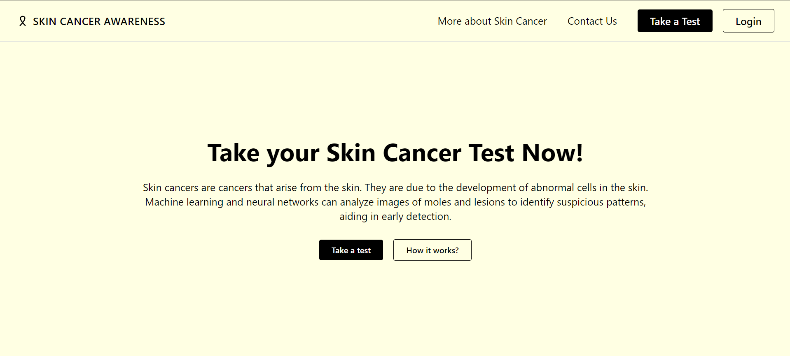
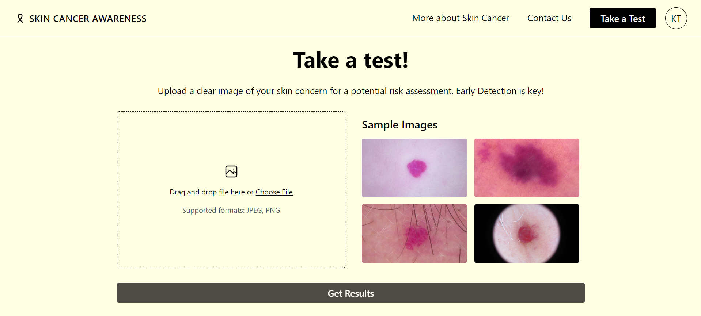
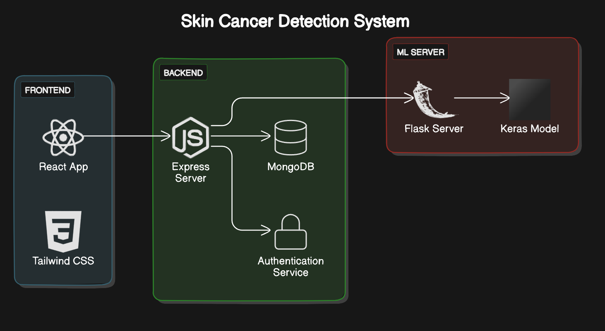
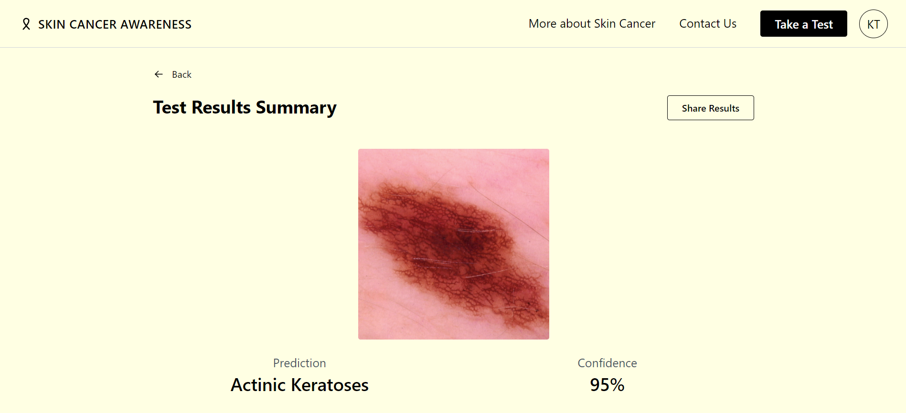
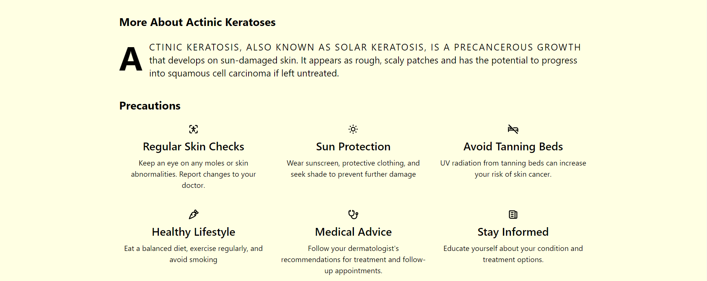

# Skin Cancer Detection using Deep CNN





Skin Cancer Detection project is a sophisticated web application developed to detect skin cancer utilizing advanced deep learning techniques.

## Features

- User account creation and authentication system.
- Test conducting functionality for users.
- Ability to share test results with doctors.
- Viewing test history.
- Integration of React and Tailwind CSS for frontend development.
- Utilization of Express for backend implementation.
- Connection to MongoDB for data storage.
- Training of predictive model using TensorFlow and Keras for skin cancer detection.

## Installation

1. Install Node.js, Python & Git on your local machine.

2. Clone the repository to your local machine:
```sh
git clone https://github.com/karantolani/skin-cancer-detection.git
```
3. The steps to run server is mentioned in the respective folder.

## Visual Aid




